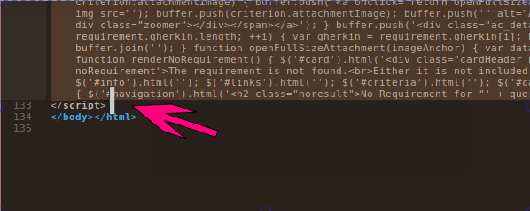
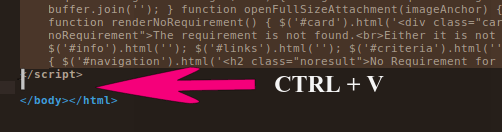
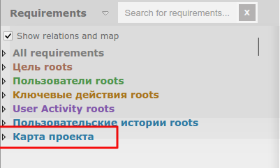
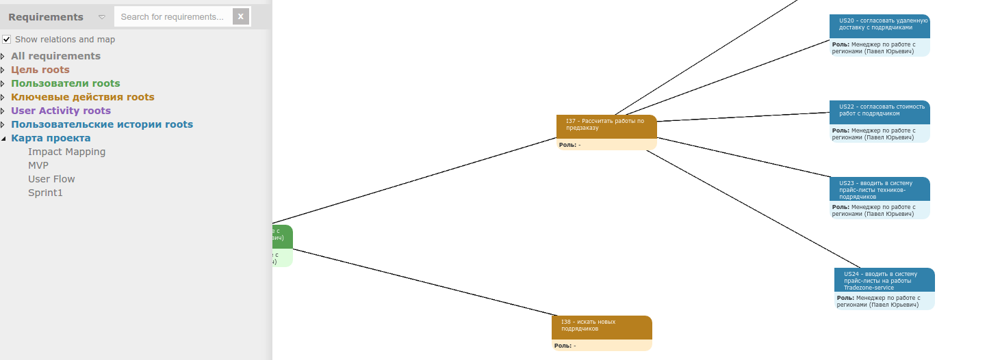

# specloghtmlmap
map for speclog html report

1. Prepare html report https://github.com/techtalk/SpecLog-Resources/wiki/Html-Export
2. Open speclog html report in text editor:
 
3. Insert content of speclogMapBuilder.js after </script>
 
4. Now you can view map of workspace like in desktop app
 
 